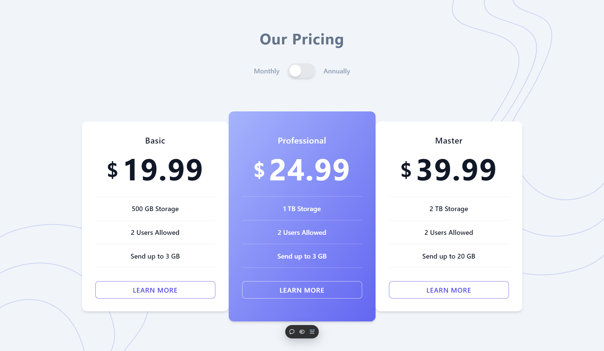

# Pricing Component

This is a pricing component built with React, Tailwind CSS, and TypeScript. It allows users to toggle between annual and monthly pricing using React context for state management.

## Features

-   Toggle between annual and monthly pricing

## Screenshots

## Usage

1. Toggle between annual and monthly pricing using the switch button.
2. The prices displayed will update accordingly based on the selected billing cycle.

## Technologies Used

-   [React](https://reactjs.org/)
-   [Tailwind CSS](https://tailwindcss.com/)
-   [TypeScript](https://www.typescriptlang.org/)
